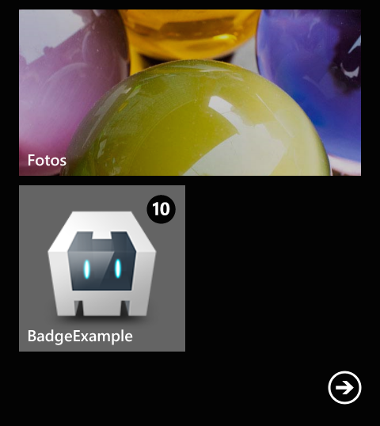

[](https://www.paypal.com/cgi-bin/webscr?cmd=_s-xclick&hosted_button_id=FF6GG425KEQ3E "Donate once-off to this project using Paypal")
[](http://badge.fury.io/js/de.appplant.cordova.plugin.badge)
[](https://codeclimate.com/github/katzer/cordova-plugin-badge)

Cordova Badge Plugin - Example
==============================

[Cordova][cordova] plugin to access and modify the badge number of the app icon on various mobile platforms including iOS, Android and Windows Phone.

## Instructions
[Download][zip] or clone the _example_ branch and run the following command:

```bash
cordova build [android|browser|ios|windows|wp8]
cordova run   [android|browser|ios|windows|wp8]
```

These will lunch the simulator or any plugged in device and start the example application as seen below in the screenshots. Its also possible to open the project with [Xcode][xcode], [Android Studio][as] or [Visual Studio][vs].

<p align="center">
    </img>
</p>

A click on the _"Set 10 as badge number"_ button will display the badge number on the home screen or notification center on Android.

```javascript
cordova.plugins.notification.badge.set(10);
```

Please read the plugin's [README][readme] for further requirements and informations.

### iOS8 Permission
Since iOS8 to use of badge noficiations the user has to grant the permission before trying to set a badge number. Use the _"Prompt for permission"_ to prompt the use to grant the permission. Note that the OS will only prompt the user only once! Later the user needs to configure the settings manually.

<p align="center">
    </img>
</p>


## Screenshots

<p align="center">
    </img>
    &nbsp;
    </img>
</p>
<p align="center">
    </img>
</p>


## Supporting
Your support is needed. If you use the plugin please support us in order to ensure further development and send us a drop through the donation button.

Thank you!

[](https://www.paypal.com/cgi-bin/webscr?cmd=_s-xclick&hosted_button_id=FF6GG425KEQ3E "Donate once-off to this project using Paypal")


## License

This software is released under the [Apache 2.0 License][apache2_license].

© 2013-2016 appPlant GmbH, Inc. All rights reserved


[cordova]: https://cordova.apache.org
[readme]: https://github.com/katzer/cordova-plugin-badge/blob/master/README.md
[zip]: https://github.com/katzer/cordova-plugin-badge/archive/example.zip
[xcode]: https://developer.apple.com/xcode/
[as]: https://developer.android.com/sdk/installing/studio.html
[vs]: https://www.visualstudio.com
[apache2_license]: http://opensource.org/licenses/Apache-2.0


