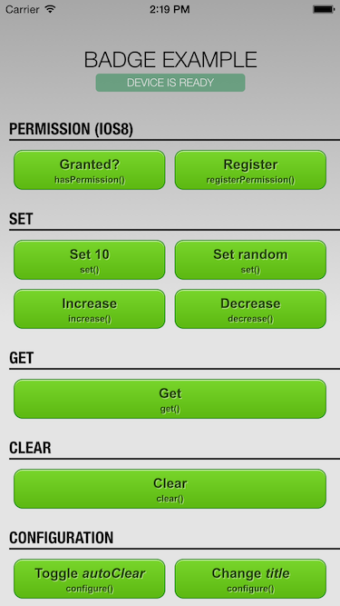
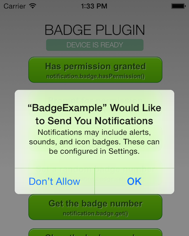
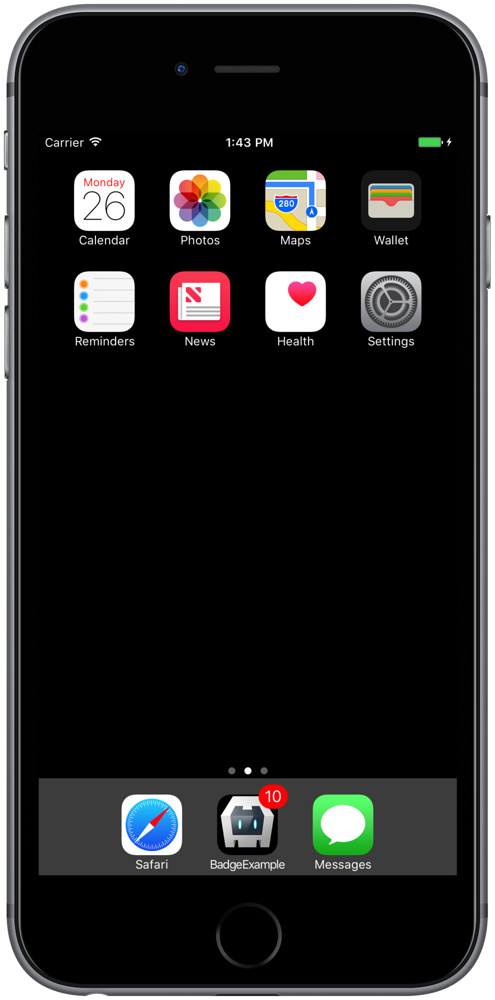
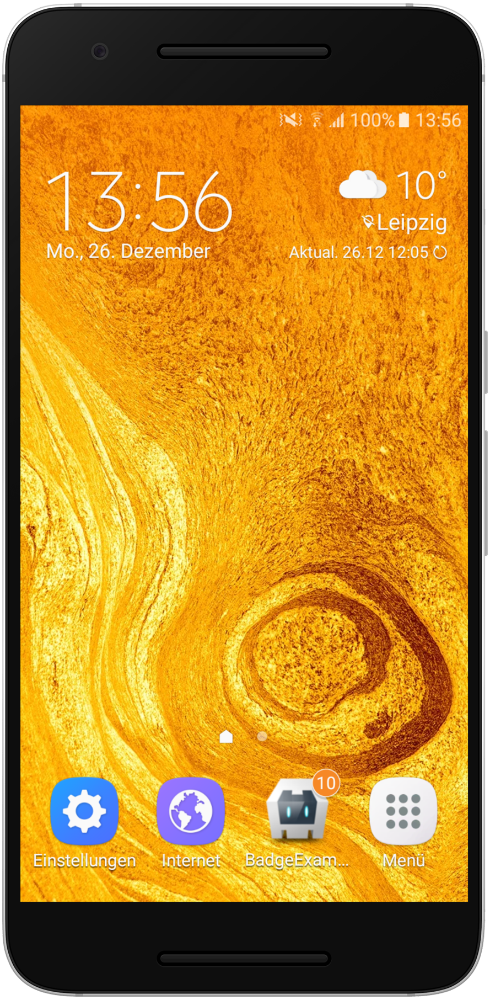
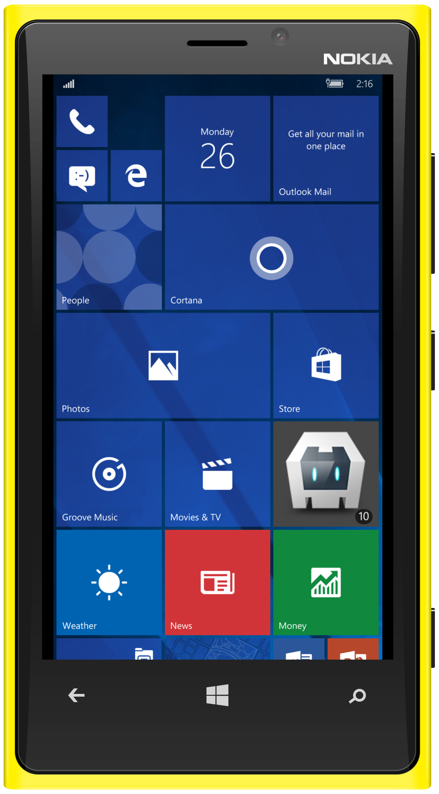

Cordova Badge Plugin - Sample App
=================================



[Cordova][cordova] plugin to access and modify the badge number of the app icon on various mobile platforms including iOS, Android and Windows Phone.

## Instructions
Clone the _example_ branch:

    git clone -b example https://github.com/katzer/cordova-plugin-badge.git

And then execute:

    cordova run [android|browser|ios|windows|wp8]

These will lunch the simulator or any plugged in device and start the example application as seen below in the screenshots. It is also possible to open the project with [Android Studio][studio], [Xcode][xcode] or [Visual Studio][vs].

A click on the _RAND_ button will display a random number on the home screen where the app icon is located.

```javascript
cordova.plugins.notification.badge.set(NUMBER);
```

Please read the plugin's [README][readme] for further requirements and informations.



### Permissions

Since iOS8 to use of badge noficiations the user has to grant the permission before trying to set a badge number. Use the _"Prompt for permission"_ to prompt the use to grant the permission. Note that the OS will prompt the user only once! Later the user needs to configure the settings manually.


## Screenshots

<p align="center">
    </img>
    &nbsp;
    </img>
    &nbsp;
    </img>
</p>


## License

This software is released under the [Apache 2.0 License][apache2_license].

Made with :yum: from Leipzig

© 2016 [appPlant GmbH][appplant]


[cordova]: https://cordova.apache.org
[studio]: https://developer.android.com/sdk/installing/studio.html
[xcode]: https://developer.apple.com/xcode/
[vs]: https://www.visualstudio.com
[readme]: https://github.com/katzer/cordova-plugin-badge/blob/master/README.md
[apache2_license]: http://opensource.org/licenses/Apache-2.0


